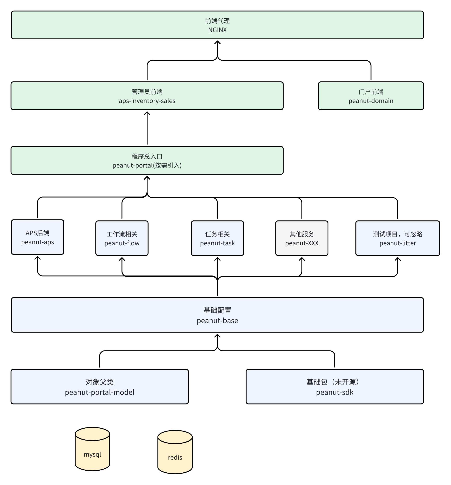

# 免责声明

[免责声明](doc%2Fdisclaimers.md)

# 安装文档

[用户安装手册](doc/install.md)

[二开手册](doc/second-develop.md)

[工作流相关](doc/workflow.md)

# 前端地址

[aps-web](https://gitee.com/slsplatform/aps-inventory-sales)

# 用户配置

| 用户名         | 密码    | 说明   |
|-------------|-------|------|
| 18600000000 | admin | 默认用户 |

# 项目拆解

> 项目可按需引入，也可单独启动， 启动更自由

| 模块名称    | 模块依赖          | 包含内容                  | 仓库地址                                                |
|---------|---------------|-----------------------|-----------------------------------------------------|
| 基础模块    | peanut-base   | 基础配置                  | [仓库地址](https://gitee.com/slsplatform/peanut-base)   |
| aps排产排程 | peanut-aps    | 预测，排产排程系统             | [仓库地址](https://gitee.com/slsplatform/peanut-aps)    |
| 任务模块    | peanut-task   | 任务编排,历史查询，AI接入 ,未完全实现 | [仓库地址](https://gitee.com/slsplatform/peanut-task)   |
| 工作流模块   | peanut-flow   | 工作流相关 ,未完全实现          | [仓库地址](https://gitee.com/slsplatform/peanut-flow )  |
| 测试模块    | peanut-litter | 进存销，盘点项目，测试项目         | [仓库地址](https://gitee.com/slsplatform/peanut-litter) |

## 项目依赖



# 技术栈

## 后端

| 组建名称              | 依赖版本         | 说明                                                                           |
|-------------------|--------------|------------------------------------------------------------------------------|
| JDK               | jdk 21       | Jdk最低版本                                                                      |
| Spring Boot       | 3.2.0        | springboot版本                                                                 |
| mybatis-plus      | 3.5.8        | mybatisplus版本                                                                |
| mybatis-plus-join | 1.4.8.1      | mybatisplus-join版本                                                           | 
| lombok            | 1.18.22      | lombok版本                                                                     |
| uber-h3           | 4.1.1        | 经纬度转code码                                                                    |
| hutool            | 5.8.23       | 常用工具库                                                                        |
| drools            | 7.74.1.Final | 规则引擎                                                                         |
| fastjson2         | 2.0.46       | fastjson2版本                                                                  |
| or-tools          | 9.9.3963     | 算法求解器  [帮助文档](https://developers.google.cn/optimization?authuser=0&hl=zh-cn) |

### 注解

| 组件名称                                | 描述          | 使用点                          | 使用类                |
|-------------------------------------|-------------|------------------------------|--------------------|
| SetUserName                         | 设置用户名       | 增加用户名的查询                     | SetNameAspect      |
| InsertCheck,DeleteCheck,UpdateCheck | 增删改检查       | spring Valid 校验              |                    |
| MaskValue                           | 返回值掩码       | 返回字段标注,掩码类型:DesensitizedType | WebBeanConfig      |
| MethodExt                           | 方法扩展        | 日志输出                         | WebLogAspect       |
| MockRet                             | 模拟返回值       | 模拟返回值                        | MockRetAspect      |
| RedissonLockAnn                     | redisson锁注解 | redisson锁注解                  | RedissonLockAspect |
| Timed                               | 方法执行耗时      | 方法耗时判断                       | TimedAspect        |

### AOP 切面

| 组件名称               | 描述                    |
|--------------------|-----------------------|
| WebLogAspect       | 日志切面                  |
| NextSpanAspect     | 链路追踪切面,不同方法使用不同spanId |
| SetNameAspect      | 根据指定字段根据Id设置指定字段的用户名  |
| MockRetAspect      | 模拟返回值切面               |
| TimedAspect        | 方法执行耗时切面              |
| RedissonLockAspect | redisson锁切面           |

### BeanConfig

| 类名                    | 描述                                       | --                            |
|-----------------------|------------------------------------------|-------------------------------|
| DroolsConfig          | drools规则引擎配置                             |                               |
| MybatisConfig         | mybatis-plus配置,包含租户, 整表删除,数据过滤, 分页等      |                               |
| MyMetaObjectHandler   | mybatis-plus 数据自动填充  ,创建人、时间,修改人、时间,调用链等 |                               |
| PeanutProperties      | 配置文件   ,见后段参数                            |                               |
| ResultResponseWrapper | 预设 feign 拦截器,统一返回值                       |                               |
| MockResourceLoad      | mock数据配置                                 | 返回接口的mock值                    |
| ResultResponseWrapper | 接口返回值修改                                  | 根据请求头判断返回值是否进行二次包装            |
| ServiceNotice         | 通知类接口                                    | 可以接入钉钉机器人等                    |
| WebBeanConfig         | web配置                                    | 字段序列化等配置,字段指定时MaskValue进行数据脱敏 |

### Service

| 组件名称                | 描述       | --                                                                            |
|---------------------|----------|-------------------------------------------------------------------------------|
| DingEventBizService | 钉钉消息处理接口 | 实现该接口,处理钉钉消息, 一个eventType可以多次实现处理(并行调用)                                       |
| SetNameService      | 设置显示名称   | 调用该接口可以根据指定字段的ID设置对应的字段的显示名称,如根据工厂ID设置工厂名称,eq: ApsGoodsBomServiceImpl.setName |

### mybatis-plus

| 组件名称                             | 描述     | 使用点                      |
|----------------------------------|--------|--------------------------|
| TenantLineInnerInterceptor       | 租户插件   | 按租户进行数据隔离                |
| OptimisticLockerInnerInterceptor | 乐观锁插件  | 避免全表操作                   |
| PaginationInnerInterceptor       | 分页操作   | 使用 page操作                |
| MyMetaObjectHandler              | 数据自动填充 | 对象集成 BaseEntity, 给指定字段赋值 |

### 后端参数(peanut:)

| 参数名称                         | 参数类型             | 参数说明                                 | 默认值 |  
|------------------------------|------------------|--------------------------------------|-----|
| scanProperty2UseInTimeSecond | int              | 资产禁用时,N秒扫描内二次扫描时,启用该资产               | 60  |
| entityPackageName            | String           | 指定包名下查找类的BelongDb 注解,进行数据库表字段的初始化与修改 |
| redisKey                     | String           | redis key前缀                          |     |
| urlWhiteList                 | List<String>     | 白名单,指定接口时,可访问的接口,不进行二次包装             |     |
| aps.forecastMainPrefix       | String           | 预测主前缀                                |     |
| aps.forecastMainSuffix       | String           | 预测前缀                                 |     |
| sale2ProjectThreadSize       | int              | 预测子线程数                               |     |
| dingConfigList               | List<DingConfig> | 钉钉机器人配置                              |     |
| DingConfig.clientId          | String           | 钉钉clientId                           |     |
| DingConfig.clientSecret      | String           | 钉钉clientSecret                       |     |
| DingConfig.agentId           | Long             | 钉钉agentId                            |     |
| DingConfig.robotCode         | String           | 钉钉编号                                 |     |
| DingConfig.dingCode          | String           | 钉钉编号                                 |     |
| DingConfig.dingName          | String           | 钉钉名称                                 |     |
| DingConfig.useStream         | boolean          | 是否启用钉钉监听                             |     |

### 后端参数(spring:)

[见安装手册](doc/install.md)

# 数据库

| 组建名称  | 依赖版本 | 说明      |
|-------|------|---------|
| mysql | 8.0  | mysql版本 |

# 分库分表

## 修改点

> 增加： shardingsphere-jdbc-core-spring-boot-starter 依赖  
> 排除数据库启动：@SpringBootApplication(exclude = {DataSourceAutoConfiguration.class})

```sql
 --  删除分库分表sql
RENAME TABLE peanut_prod.aps_order_goods_bom_0 TO peanut_prod.aps_order_goods_bom;
RENAME TABLE peanut_prod.aps_order_goods_project_config_0 TO peanut_prod.aps_order_goods_project_config;
RENAME TABLE peanut_prod.aps_order_goods_sale_config_0 TO peanut_prod.aps_order_goods_sale_config;
RENAME TABLE peanut_prod.aps_order_goods_status_date_0 TO peanut_prod.aps_order_goods_status_date;
RENAME TABLE peanut_prod.aps_rolling_forecast_order_item_0 TO peanut_prod.aps_rolling_forecast_order_item;
RENAME TABLE peanut_prod.aps_scheduling_goods_bom_0 TO peanut_prod.aps_scheduling_goods_bom;
RENAME TABLE peanut_prod.aps_scheduling_goods_bom_total_0 TO peanut_prod.aps_scheduling_goods_bom_total;


-- 执行分库分表sql

RENAME TABLE peanut_prod.aps_order_goods_bom TO peanut_prod.aps_order_goods_bom_0;
RENAME TABLE peanut_prod.aps_order_goods_project_config TO peanut_prod.aps_order_goods_project_config_0;
RENAME TABLE peanut_prod.aps_order_goods_sale_config TO peanut_prod.aps_order_goods_sale_config_0;
RENAME TABLE peanut_prod.aps_order_goods_status_date TO peanut_prod.aps_order_goods_status_date_0;
RENAME TABLE peanut_prod.aps_rolling_forecast_order_item TO peanut_prod.aps_rolling_forecast_order_item_0;
RENAME TABLE peanut_prod.aps_scheduling_goods_bom TO peanut_prod.aps_scheduling_goods_bom_0;
RENAME TABLE peanut_prod.aps_scheduling_goods_bom_total TO peanut_prod.aps_scheduling_goods_bom_total_0;

```

| 表名                                | 数据内容     |
|-----------------------------------|----------|
| aps_order_goods_bom_0             | 订单商品零件   | 
| aps_order_goods_project_config_0  | 订单商品工程特征 | 
| aps_order_goods_sale_config_0     | 订单商品销售特征 | 
| aps_order_goods_status_date_0     | 订单商品状态   | 
| aps_rolling_forecast_order_item_0 | 滚动预测商品状态 | 
| aps_scheduling_goods_bom_0        | 排产商品零件   | 
| aps_scheduling_goods_bom_total_0  | 排产商品零件汇总 | 

---

# idea 相关

## idea 插件

| 插件名称                       | 描述                                                       | 备注                                                                                                                  |
|----------------------------|----------------------------------------------------------|---------------------------------------------------------------------------------------------------------------------|
| Lombok                     | lombok                                                   | 常用方法注解                                                                                                              |
| EasyCode-MybatisCodeHelper | 代码生成器  ,模版见 [EasyCodeConfig.json](./EasyCodeConfig.json) | 插件地址 [官网](https://plugins.jetbrains.com/plugin/13847-easycode-mybatiscodehelper)                                    |
| drools                     | 规则引擎编辑器                                                  | 插件地址 [官网](https://plugins.jetbrains.com/plugin/16871-drools)                                                        |
| mybatisLogFree             | 输出可执行 mybaits 日志                                         | 插件地址 [官网](https://plugins.jetbrains.com/plugin/17898-mybatis-log-free)                                              |
| TONGYI Lingma              | 通义灵码 ,代码提示插件                                             | 插件地址 [官网](https://plugins.jetbrains.com/plugin/17809-tongyi-lingma--your-ai-coding-assistant-type-less-code-more- ) |
| CommitMessage              | git 提交规范插件                                               | 插件地址 [官网](https://plugins.jetbrains.com/plugin/17809-tongyi-lingma--your-ai-coding-assistant-type-less-code-more- ) |
| ColorfulBrackets           | 括号变色插件                                                   | 插件地址 [官网](https://plugins.jetbrains.com/plugin/24565-colorfulbrackets )                                             |


