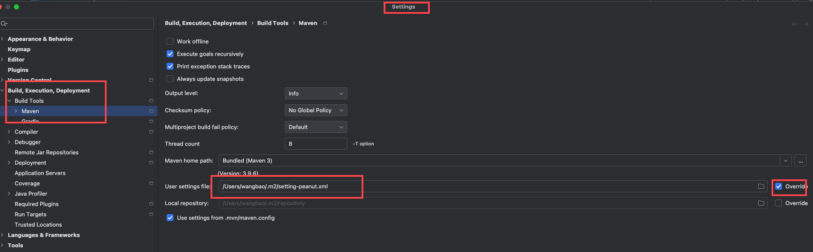

# 安装文档

# 后端

## 后端配置

| 硬件  | 配置 | 说明 |
|-----|----|----|
| CPU | 2核 |    |
| 内存  | 4G |    |

### 后端软件配置

| 软件    | 版本    | 说明                                                                        |
|-------|-------|---------------------------------------------------------------------------|
| MySQL | 8     |                                                                           |
| Redis | 6     | [安装](https://zhuanlan.zhihu.com/p/700234831)                              |
| JDK   | 21    | [环境变量配置](https://blog.csdn.net/weixin_52070377/article/details/133829439) |
| maven | 3.8.4 | 下载依赖打包使用                                                                  |

### 安装步骤

0. maven 配置

[settings.xml](settings.xml)

1. 下载源码

```bash
  
    git clone https://gitee.com/slsplatform/peanut-end.git
  
```

2. 切换到项目目录,并修改mysql,redis配置

```bash
    sql 执行文件 说明:
     sql/db-sql.zip >>  表结构+数据
     sql/delete-*.sql >>  删除改模块下数据sql
     sql/tmp.sql  >> 临时sql, 测试用
    
    cd  peanut-end
    # 修改mysql,redis配置
    resources/application.yml
       spring:
          mail:
            # 参考 https://baijiahao.baidu.com/s?id=1695308391844521693&wfr=spider&for=pc
            password: 邮箱授权码
            username: 邮箱地址
            host: 邮箱发送地址
            port: 465
         datasource:
           url: jdbc:mysql://127.0.0.1:3306/peanut?useUnicode=true&characterEncoding=utf-8&useSSL=false&serverTimezone=Asia/Shanghai
           username: root
           password: 123456
         redis:
           host: 127.0.0.1
           port: 6379
           password:
           redisson:
             # 此处也需要修改
             file: classpath:redisson.yml
           
```

3. 编译打包

```bash

    mvn install -DskipTests clean package
  
```

4. 获取打包文件

```bash

    target/app.jar
  
```

5. 编辑启动脚本 (run-app.sh)

```bash
 
    rm -rf   log.log
    nohup java  -Dfile.encoding=UTF-8    -Xms512m -Xmx3000m    -jar   -Dspring.profiles.active=fwq  -Dserver.port=8080 app.jar >  log.log  2>&1 &
  
```

6. 启动app

```bash

    sh run-app.sh
  
```

# 问题

0. 启动报错:  ServiceNotice.* 依赖注入失败

> 检查 mysql是否正确, mysql版本,mysql驱动版本, jdbc连接地址,用户名,密码
> 检查 redis是否正确, 包含 application.yml中 redis节点和 redisson.yml 配置

1. 启动报错:  Resource ortools-win32-x86-64/ was not found in ClassLoader jdk.internal.loader.ClassLoaders答:

> 问题原因: ortools依赖的window组建依赖过大,生产为linux系统,不用此组建,为避免打包过大,所以删除该依赖
> 方法1: 在类BootstrapApplication 中找到 :  Loader.loadNativeLibraries(); 注释掉该语句
> 方法2: pom.xml中 ortools-java依赖排除的节点删除,增加项目依赖

2. 打包后文件

> 打包后在[target](../target) 生成两个jar文件 , app.jar 即部署jar文件

3. 执行时数据库缺少字段

> 目前项目还在开发中, sql文件未更新,请手动添加字段或微信联系获取最新数据结构

4. 列表展示字段为空,或修改字段显示宽度

> 请修改base_table_header中配置, 或菜单:基础配置=>表格头管理
> biz_key: 来自对应的业务ServiceImpl中setQueryListHeader方法查看

5. SpringBoot启动报错:java.nio.charset.MalformedInputException: Input length = 1解决方案

> 问题原因: 文件编码问题, 请使用 utf-8编码,修改方法: https://blog.51cto.com/u_2870645/5295690
> 修改后,重新获取源码,重新编译,重新打包

6. com.olivia:peanut-sdk: 下载失败

> maven 下载失败, 下载 [setting.xml](settings.xml) 到本地文件（ setting-peanut.xml ）,增加仓库配置 , idea中指定使用setting文件
> 

7. 缺少依赖，如： peanut-task 格式为: peanut-XXXX

> 问题原因： 依赖暂时不提供该版本， 请联系开发人员申请该模块权限，或者取消模块依赖。

8. 数据库导入失败

> 如有报错：MySQL: Error Code: 1118 Row size too large (> 8126). Changing some columns to TEXT or BLOB  
> 则执行sql关闭严格模式： set innodb_strict_mode = 0; 
