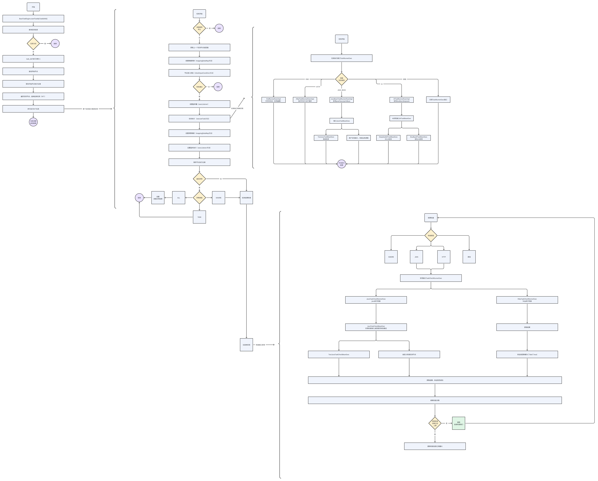

# 任务编排 demo

````json
[
  {
    "id": "0",
    "x": 0,
    "y": 0,
    "taskName": "开始",
    "taskType": "BEGIN",
    "x_": 75,
    "y_": 75
  },
  {
    "id": "tk-4380117",
    "x": 150,
    "y": 150,
    "taskName": "测试测",
    "taskType": "JAVA_BEAN",
    "taskBeanName": "test",
    "retryInterval": 3000,
    "retryCount": 0,
    "checkType": "",
    "executeCount": 1,
    "timeOut": 3000,
    "exceptionStop": "ALL",
    "inputMappingList": [
      {
        "source": "qd",
        "target": "tt",
        "mappingType": "to",
        "javaExpression": ""
      }
    ],
    "outputMappingList": [
      {
        "source": "dfi",
        "target": "ewr",
        "mappingType": "to",
        "javaExpression": ""
      }
    ],
    "sourceTaskId": "0",
    "sourceTaskCondition": "",
    "taskJavaType": "springBean",
    "x_": 225,
    "y_": 225
  },
  {
    "id": "tk-2255117",
    "x": 300,
    "y": 300,
    "taskName": "结束了",
    "taskType": "END",
    "retryInterval": 3000,
    "retryCount": 0,
    "checkType": "",
    "executeCount": 1,
    "timeOut": 3000,
    "exceptionStop": "ALL",
    "inputMappingList": [
      {
        "source": "",
        "target": "",
        "mappingType": "to",
        "javaExpression": ""
      }
    ],
    "outputMappingList": [
      {
        "source": "",
        "target": "",
        "mappingType": "to",
        "javaExpression": ""
      }
    ],
    "sourceTaskId": "tk-4380117",
    "sourceTaskCondition": "",
    "x_": 375,
    "y_": 375
  }
]

````

## 任务引擎

1. 发起，任务ID
2. 查找第一个任务：
3. 开始执行： DOING
4. 前置监听器：
5. 方法执行：
6. 后置监听器
7. 方法结束
8. 根据流转获取下N个任务 ，标记任务状态待开始 TODO：
9. 返回2执行
10. 都执行结束：
11. 任务执行结束
12. 异常抛出

# 任务配置

1. 前置监听器
2. 方法执行
3. 后置监听器
4. 结束
5. 异常抛出

# 任务引擎实现

包名:  com.olivia.peanut.task.engine


| 类名                       | 实现功能         | 备注                                                                                                             |
| -------------------------- | ---------------- | ---------------------------------------------------------------------------------------------------------------- |
| BaseTaskEngine             | 引擎主入口       | Long startTaskId(Long taskId) 开始一个任务                                                                       |
| TaskInfoDefRunner          | 任务执行封装类   | 任务实际执行具体实现                                                                                             |
| TaskRunnerExec             | 任务分发执行类   | 实现java或http接口调用,后续有其他类型调用需实现该接口， 注解： @Component("类型名称（小写）" + "TaskRunnerExec") |
| JavaBeanTaskRunnerExecImpl | java 任务实现    | TaskRunnerExec实现类， 流程配置主要实现该接口                                                                    |
| HttpTaskRunnerExecImpl     | http接口调用     | TaskRunnerExec实现类， 使用HttpClient进行post或get地址调用                                                       |
| EndRunnerExecImpl          | 结束日志输出     | TaskRunnerExec实现类， 仅记录日志 ，标志流程结束                                                                 |
| TaskListener               | java监听器       | 实现前置或后置监听器                                                                                             |
| JavaTaskBeanExec           | java 任务执行器  | 任务环节中任务实现这个接口，支持spring或javaClass                                                                |
| TaskCheckRunnerExec        | 任务检查接口     | 任务配置中心检查任务状态接口                                                                                     |
| HttpTaskCheckRunnerExec    | 任务检查接口     | TaskCheckRunnerExec实现类，返回结果为 {"data":true} 时，确认正确，进行下一轮                                     |
| JavaTaskCheckRunnerExec    | java任务检查接口 | TaskCheckRunnerExec实现类  ，支持spring或javaClass，两种必须实现JavaTaskCheckBeanExec接口                        |
| JavaTaskCheckBeanExec      | 任务检查接口     | 自定义java实现接口，检查任务是否成功，用户需自己定义任务是否成功                                                 |
| TestJavaTaskCheckBeanExec  | 任务检查接口     | JavaTaskCheckBeanExec 实现类，默认task执行成功                                                                   |


# 任务引擎类流转示意图

